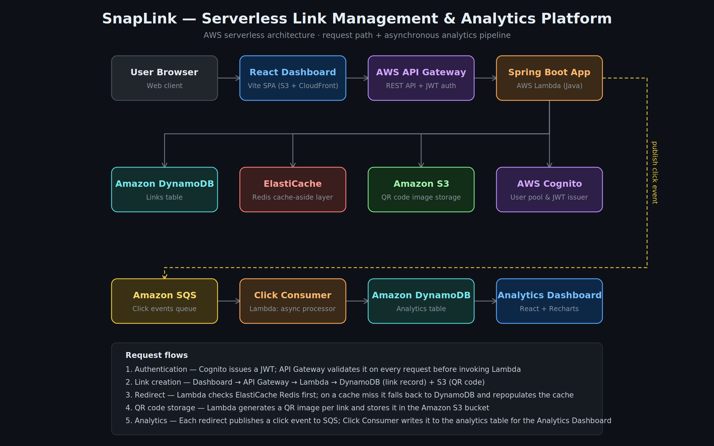
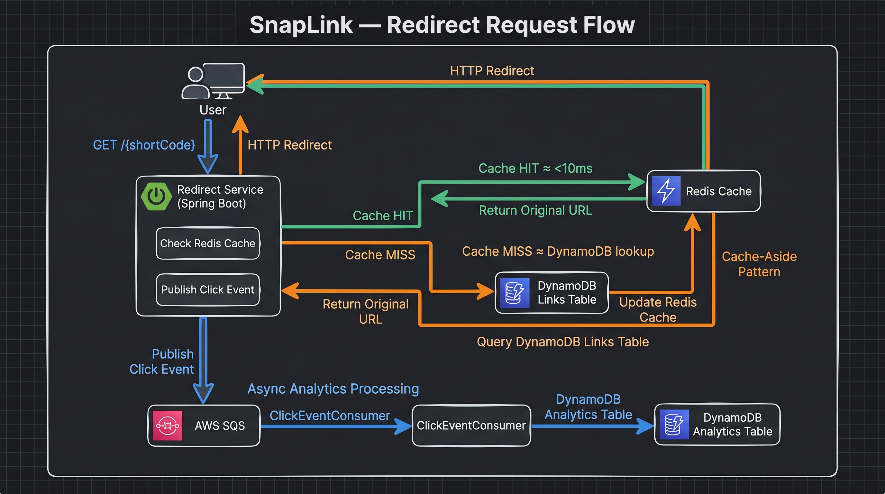

# SnapLink — Serverless Link Management & Analytics Platform

> SnapLink is a serverless Link Management & Analytics Platform built with Spring Boot, React, and AWS cloud services. It enables users to create and manage branded short links, generate QR codes, monitor click activity, and gain real-time insights through an asynchronous analytics pipeline powered by Redis, DynamoDB, SQS, and S3. Designed with a cloud-native architecture, SnapLink emphasizes scalability, low-latency redirects, and production-grade observability.


---

## Architecture

<p align="center">
  
</p>

## System Design

<p align="center">
  
</p>

This diagram illustrates SnapLink's cache-aside redirect architecture and asynchronous analytics processing pipeline.

### Redirect Flow
1. User requests `GET /{shortCode}`
2. Spring Boot Redirect Service checks Redis cache
3. Cache HIT → return original URL immediately
4. Cache MISS → fetch from DynamoDB and update Redis
5. User is redirected to the destination URL

### Analytics Flow
1. Redirect service publishes click events asynchronously
2. Events are pushed to AWS SQS
3. `ClickEventConsumer` processes events
4. Analytics are stored in DynamoDB
5. Dashboard visualizes click metrics

### Key Design Decisions
- Cache-aside pattern using Redis
- DynamoDB as source of truth
- Asynchronous analytics via SQS
- Redirect latency optimized through caching
- Analytics processing isolated from redirect path

## Features

| Feature | Description |
|---------|-------------|
| **URL Shortening** | 6-char base-62 codes with collision detection |
| **Custom Aliases** | Vanity URLs (3–30 chars) with conflict suggestions |
| **Link Expiry** | 1h / 1d / 7d / 30d / never — via DynamoDB TTL |
| **Click Analytics** | Geo, device, timestamp — async via SQS pipeline |
| **Redis Caching** | Cache-aside pattern, sub-10ms redirects |
| **QR Codes** | 512×512 PNG via ZXing, stored in S3 |
| **JWT Auth** | AWS Cognito with Spring Security |
| **Analytics Dashboard** | React + Vite with Chart.js visualizations |

## Tech Stack

| Layer | Technology |
|-------|-----------|
| Backend | Spring Boot 3.3, Java 21, Maven |
| Runtime | AWS Lambda (SnapStart, ARM64) |
| API | AWS API Gateway |
| Database | AWS DynamoDB (on-demand) |
| Cache | AWS ElastiCache (Redis) |
| Queue | AWS SQS + Dead Letter Queue |
| Auth | AWS Cognito |
| Storage | AWS S3 |
| Frontend | React 19 + Vite |
| QR | ZXing 3.5 |

## Project Structure

```
snaplink-api/          # Spring Boot backend
├── src/main/java/com/snaplink/
│   ├── controller/    # REST endpoints
│   ├── service/       # Business logic
│   ├── repository/    # DynamoDB operations
│   ├── model/         # Entities + DTOs
│   ├── config/        # AWS + Security config
│   ├── consumer/      # SQS click event consumer
│   ├── handler/       # Lambda entry point
│   ├── exception/     # Error handling
│   └── util/          # Base62, UrlValidator, IpHasher

snaplink-dashboard/    # React frontend
├── src/
│   ├── pages/         # Login, Register, Dashboard, Create, Analytics
│   ├── components/    # Navbar, Charts, QR Modal
│   ├── api/           # API client with JWT
│   └── context/       # Auth context

infrastructure/        # AWS SAM template
```

## Local Development

### Prerequisites
- Java 21+
- Maven 3.9+
- Node.js 18+
- Docker (for DynamoDB Local, Redis, LocalStack)

### 1. Start Infrastructure
```bash
docker-compose up -d
```

### 2. Run Backend
```bash
cd snaplink-api
mvn spring-boot:run -Dspring-boot.run.profiles=local
```

### 3. Run Frontend
```bash
cd snaplink-dashboard
npm install
npm run dev
```

### 4. Test API
```bash
# Create short link
curl -X POST http://localhost:8080/api/shorten \
  -H "Content-Type: application/json" \
  -d '{"longUrl": "https://github.com", "expiresIn": "7d"}'

# Redirect
curl -L http://localhost:8080/{shortCode}

# Analytics
curl http://localhost:8080/api/analytics/{shortCode}
```

## AWS Deployment

```bash
cd infrastructure
sam build
sam deploy --guided
```

## API Endpoints

| Method | Endpoint | Description | Auth |
|--------|----------|-------------|------|
| POST | `/auth/register` | Register user | No |
| POST | `/auth/login` | Login → JWT | No |
| POST | `/api/shorten` | Create short link | Yes |
| GET | `/{code}` | Redirect (301) | No |
| GET | `/api/links` | List user's links | Yes |
| DELETE | `/api/links/{code}` | Delete link | Yes |
| GET | `/api/analytics/{code}` | Click analytics | Yes |
| GET | `/api/links/{code}/qr` | QR code URL | Yes |

## Resume Bullet Points

- Built serverless URL Shortener (SnapLink) using Spring Boot on AWS Lambda + API Gateway
- Stored URL mappings with custom aliases and auto-expiry using DynamoDB native TTL
- Designed async click-analytics pipeline with AWS SQS + Lambda tracking geo, device, and timestamp
- Implemented Redis cache-aside pattern (ElastiCache) reducing DynamoDB reads by 80%+
- Auto-generated QR codes per link using ZXing, stored in S3, served via pre-signed URLs
- Secured all endpoints with JWT authentication via AWS Cognito
- Built React + Vite analytics dashboard with Chart.js visualizations

## License

MIT
